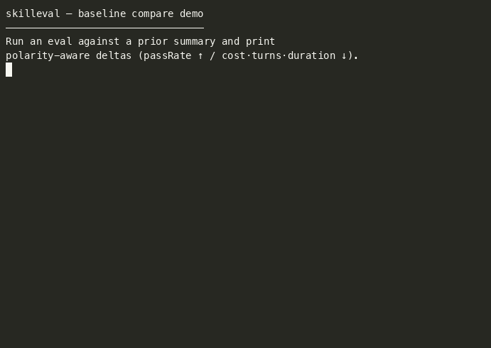

# skilleval

**Agent skills are prompts, not code — and there's no compiler to catch a broken one.**

Solo, that means regressions slip through until a user hits them. On a team, it's worse: someone tweaks a shared skill, and review has nothing to go on but read-through and hope. skilleval runs the skill against a real agent and checks deterministic observables — tools used, files changed, turns taken, cost, final message — so a change is judged on evidence, not guesswork.

```ts
import { run, expect } from "@danielwaltersdev/skilleval";

const { result, workspace } = await run({
  name: "refactor-helper",
  prompt: "…",
  skill: "./skills/refactor-helper",
  model: "composer-2.5",
});

expect(result).skills.activated.toInclude("refactor-helper");
expect(result, workspace).file("src/foo.go").toHaveBeenModified();
expect(result).costUSD.toBeLessThanOrEqual(1);
```

Ship skills with the same confidence you ship code.



---

## Install

```bash
npm install @danielwaltersdev/skilleval
```

That gives you the typed client and a platform `skilleval` binary. Node.js 18+.

Credentials for live runs (cwd `.env` is loaded automatically; process env wins):


| Runner                      | Env                                           |
| --------------------------- | --------------------------------------------- |
| Cursor (default)            | `CURSOR_API_KEY`                              |
| Claude (`runner: "claude"`) | `ANTHROPIC_API_KEY` (or local `claude login`) |


```bash
echo 'CURSOR_API_KEY=...' > .env
```

Prefer a standalone binary? Grab one from [GitHub Releases](https://github.com/daniel-walters/skilleval/releases), or `go install github.com/daniel-walters/skilleval/cmd/skilleval@v0.1.0`.

---


## Write an eval

Drop a skill package next to your eval (must contain `SKILL.md` with `name` / `description` frontmatter):

```text
my-eval/
  eval.ts
  skills/my-skill/SKILL.md
  fixtures/my-skill/   # optional; copied into the attempt workspace
  mcp.json             # optional; native MCP config
```

Optional `replies` (scripted mid-run user messages) are documented under [Interactive skills](#interactive-skills-replies).


### TypeScript

```ts
import { run, expect } from "@danielwaltersdev/skilleval";

const { result, workspace } = await run({
  name: "refactor-helper",
  prompt: `Use the refactor-helper skill on this package:

1. Refactor src/foo.go for clarity (simplify Foo; keep package demo and the Foo name).
2. Extract a small helper into a new file src/new.go (e.g. a greetPrefix helper used by Foo).
3. Delete src/gone.go — it is obsolete legacy code.

Do all three: modify foo.go, create new.go, delete gone.go.`,
  skill: "./skills/refactor-helper",
  input: "./fixtures/refactor-helper",
  model: "composer-2.5",
});

expect(result).turns.toBeLessThanOrEqual(15);
expect(result).costUSD.toBeLessThanOrEqual(1);
expect(result).toolsUsed.toInclude("read", "edit").not.toInclude("web");
expect(result).toolCalls.named("edit").toBeGreaterThanOrEqual(1);
expect(result).toolCalls.toIncludeInOrder([
  { name: "edit", args: { path: "src/foo.go" } },
  { name: "shell", args: { command: /git commit/ } },
]);
expect(result).skills.activated.toInclude("refactor-helper");
expect(result, workspace)
  .file("src/foo.go")
  .toHaveBeenModified()
  .toContain(/func Foo/)
  .not.toContain("TODO");
expect(result, workspace)
  .file("src/new.go")
  .toHaveBeenCreated()
  .toContain("package demo");
expect(result, workspace).file("src/gone.go").toHaveBeenDeleted();
expect(result).finalMessage.toMatch(/Refactor/);
```

Run it (paths like `skill` / `input` are relative to the eval file’s directory — keep `eval.ts` next to `skills/` and `fixtures/`, or use paths relative to that folder):

```bash
skilleval run ./eval.ts
# or discover eval.ts / *.eval.ts under cwd:
skilleval run
```

```json
{
  "scripts": {
    "eval": "skilleval run"
  }
}
```

Full example: `[examples/refactor-helper/eval.ts](examples/refactor-helper/eval.ts)`. Matcher reference: `[sdk/typescript/README.md](sdk/typescript/README.md)`.

Load an existing YAML eval and assert in TypeScript if you want both:

```ts
import { loadEval, run, expect } from "@danielwaltersdev/skilleval";

const ev = await loadEval("./eval.yaml");
const { result, workspace } = await run(ev, { model: "composer-2.5" });
```


### YAML

```yaml
schemaVersion: 1
name: refactor-helper
prompt: |
  Use the refactor-helper skill…
skill: skills/refactor-helper
input: fixtures/refactor-helper
expects:
  turns:
    max: 15
  costUSD:
    max: 1
  toolsUsed:
    includes: [read, edit]
    excludes: [web]
  toolCalls:
    named:
      edit:
        min: 1
    order:
      - name: edit
        args:
          path:
            equals: src/foo.go
  skills:
    activated:
      includes: [refactor-helper]
  files:
    src/foo.go:
      status: modified
      contains: /func Foo/
      excludes:
        - TODO
    src/new.go:
      status: created
      contains: "package demo"
    src/gone.go:
      status: deleted
  finalMessage:
    contains: /Refactor/
```

```bash
skilleval run ./eval.yaml --model composer-2.5
skilleval run ./eval.yaml --model composer-2.5 --runner claude
```

Paths in the YAML are relative to the YAML file. Complete examples: `[examples/refactor-helper/eval.yaml](examples/refactor-helper/eval.yaml)`, `[examples/mcp-ping/eval.yaml](examples/mcp-ping/eval.yaml)`, `[examples/interactive-confirm/eval.yaml](examples/interactive-confirm/eval.yaml)`.

### Interactive skills (`replies`)

Skills that ask a question or confirmation mid-run can take scripted follow-ups. After the initial `prompt` finishes, each entry in `replies` is sent as the next user message (same attempt, same workspace).

```yaml
prompt: |
  Use the interactive-confirm skill to clean up obsolete files.
replies:
  - yes
```

```ts
await run({
  name: "interactive-confirm",
  prompt: "Use the interactive-confirm skill to clean up obsolete files.",
  replies: ["yes"],
  skill: "./skills/interactive-confirm",
  input: "./fixtures/interactive-confirm",
  model: "composer-2.5",
});
```

The skill must complete a turn between interactions (ask, then stop). Worked example: `[examples/interactive-confirm/](examples/interactive-confirm/)`.


| Supported                         | Not supported yet                                      |
| --------------------------------- | ------------------------------------------------------ |
| Ordered scripted mid-run replies  | Live human-in-the-loop UI                              |
| Cursor and Claude runners         | Auto-answering AskQuestion / blocking elicitation tools |
|                                   | Interactive OAuth (unchanged; see MCP)                 |


---


## Assertions

Same catalog whether you write TypeScript or YAML. String matches are a literal or a slash-delimited regex (`/pattern/`). File paths are workspace-relative; optional `status` is `created` | `modified` | `deleted`. File `contains` / `equals` and `excludes` (forbidden substrings or `/regex/`, YAML list or TypeScript `.not.toContain`) require a recorded, non-deleted file outcome — same gate for positive and negated content.

When multiple expects fail in one eval, skilleval **collects** every failure and reports the full list (YAML/CLI and TypeScript). The overall eval still fails if any expect fails. Non-finished runs still gate on `run.status` before other checks.

Numeric bounds (`turns`, `durationMs`, `toolCalls`, `costUSD`, and `usage.*Tokens`):


| Bound                            | Meaning         |
| -------------------------------- | --------------- |
| `min` / `toBeGreaterThanOrEqual` | actual ≥ bound  |
| `max` / `toBeLessThanOrEqual`    | actual ≤ bound  |
| `gt` / `toBeGreaterThan`         | actual > bound  |
| `lt` / `toBeLessThan`            | actual < bound  |
| `eq` / `toBeEqual`               | actual == bound |


`toolsUsed` and `skills.activated` support include / exclude membership. Nil `costUSD` fails any cost bound.

`toolCalls` also supports:

- **Total count** — same numeric bounds as above (`min` / `toBeGreaterThanOrEqual`, …)
- **`named.<tool>`** — count bounds for one tool name (`named.edit.min` / `toolCalls.named("edit").toBeGreaterThanOrEqual(1)`)
- **`order` / `toIncludeInOrder`** — ordered **subsequence** (gaps allowed before/between/after). Each step has `name` and optional `args`. YAML arg checks use `contains` / `equals` (literal or `/regex/`). In TypeScript, a string arg means equals and a `RegExp` means match.

Result `metrics.toolCalls` entries may include lean pre-call `args` (normalized `path` and `command`; large bodies stripped). Claude `file_path` is mapped to `path`, and `path` values under the attempt workspace are stored workspace-relative.

When the harness omits `costUSD`, skilleval estimates it from `cost/rates.json`. Unknown or unpriced models leave `costUSD` nil.

Default artifacts from a CLI run: `result.json` (per attempt), `result-agent-log.json` (full turn/tool transcript beside that result), and `result-summary.json` (with `passRate` and averages). The agent log is written whenever a result is written (finished, error, or cancelled) for debugging — it is not an expect/assert surface. Optional `--timeout` bounds each attempt (Go duration, e.g. `30m`).

Eval and Result JSON use `schemaVersion: 1` — bumps only on a breaking contract change.

---


## MCP

Pass a native MCP JSON file via `mcp` (TypeScript `run({ mcp: "…" })` or YAML `mcp:`). It’s seeded into each attempt workspace:


| Runner | Seeded path        |
| ------ | ------------------ |
| Cursor | `.cursor/mcp.json` |
| Claude | `.mcp.json`        |


Both runners load project MCP only, so host/global MCP does not leak in. Put stdio server scripts under `input` so paths resolve inside the workspace. Example: `[examples/mcp-ping/](examples/mcp-ping/)`.


| Bucket                          | Local           | CI               |
| ------------------------------- | --------------- | ---------------- |
| No auth                         | ✓               | ✓                |
| Env / token (`env` / `headers`) | ✓ if env set    | ✓ via CI secrets |
| Interactive OAuth               | Not automatable | Not supported    |


Interpolation: Cursor `${env:NAME}`, Claude `${VAR}`. Do not commit secrets in fixtures.

`toolsUsed` **naming** for MCP differs by runner — Cursor uses `mcp`; Claude uses `mcp__<server>__<tool>`. Prefer runner-specific expects when asserting MCP tool names.

---


## Multi-run batches

YAML multi-run is scored by the CLI checker. TypeScript multi-run still asks the CLI to run N times, but **pass/fail lives in `batch.expect`** — programmatic `passRate` is not written into the temp YAML (empty YAML expects would always pass).

```ts
const batch = await run({
  name: "refactor-helper",
  prompt: "…",
  skill: "./skills/refactor-helper",
  model: "composer-2.5",
  attempts: 10,
  passRate: { min: 0.8 },
});

batch.expect(({ result, workspace }) => {
  expect(result, workspace).turns.toBeLessThanOrEqual(15);
  expect(result).finalMessage.toMatch(/Refactor/);
});
```

`batch.expect` isolates matcher failures per attempt, then fails the process only when the TS pass rate is below `passRate.min`. If `passRate` is omitted, the minimum is **1** (every attempt must pass) — unlike YAML, where omitting `passRate` does not fail the process.

```yaml
attempts: 10
passRate:
  min: 0.8
```

Each attempt gets its own Result. With `attempts > 1`, the CLI also writes `result-1.json` / `result-1-agent-log.json`, … and `result-summary.json`. YAML exit is non-zero only when `passRate.min` is set and the batch rate is below it — not fail-on-any-attempt. Single-attempt runs keep expect-based exit behavior. `run()` still returns `result` / `workspace` for the last successful write so one-shot `expect(result)` evals stay unchanged.

YAML expects on a `loadEval` document are still scored by the CLI; `batch.expect` is the TypeScript-expects path. CLI stdout may print PASS for empty YAML expects; the `batch.expect` block is the TS score.

---


## History and comparison

By default, runs retain summaries under `.skilleval/history/<eval-name>/` and compare against the prior `latest.json` when one exists. `.skilleval/` is gitignored. On a TTY (or with `FORCE_COLOR`), `PASS`/`FAIL` and polarity-aware baseline deltas are colored green/red; set `NO_COLOR` to disable.

```bash
skilleval run ./eval.yaml --model composer-2.5
skilleval run ./eval.yaml --model composer-2.5 --no-history --no-baseline
skilleval compare result-summary.json .skilleval/history/refactor-helper/latest.json
```

In TypeScript, `run()` tees the same CLI report (including baseline compare) to stdout. Pass `noHistory` / `noBaseline`, or `history` / `baseline` path overrides. Comparison deltas do not change exit status.

In CI, upload `*-summary.json` as an artifact; on the next job, download the prior summary and pass `--baseline`.

---


## What’s in v0.1


| In scope                                             | Not yet                            |
| ---------------------------------------------------- | ---------------------------------- |
| Cursor and Claude runners                            | Other agent runtimes (see Roadmap) |
| TypeScript `run` + `expect`, script discovery        | YAML suite discovery               |
| Multi-run batches, history, baseline compare         | Model matrix in one invocation     |
| Native project MCP seeding                           | Interactive OAuth MCP in CI        |
| Scripted mid-run user replies (`replies`)            | Live HITL / AskQuestion auto-fill  |
| npm platform binaries; GitHub Release / `go install` | Homebrew / apt                     |


## Roadmap

- **Skills for authoring evals** — agent skills that help write `eval.ts` / expects against the shared catalog
- **More providers** — Gemini, Codex, and OpenCode runners alongside Cursor and Claude
- **SDKs in more languages** - Go, Python
- **CI integration** — first-class GitHub Actions helpers (install, run, baseline artifact wiring) beyond today’s manual summary upload pattern
- **YAML suite discovery** — discover and run many YAML evals like script discovery already does
- **Model matrix** — one invocation across several models with aggregated compare

---


## Docs


| Doc                                                  | Audience                                              |
| ---------------------------------------------------- | ----------------------------------------------------- |
| [sdk/typescript/README.md](sdk/typescript/README.md) | Matcher catalog, bin resolution, local SDK develop    |
| [docs/releasing.md](docs/releasing.md)               | Cutting CLI + npm releases                            |
| [docs/development.md](docs/development.md)           | Building from source, CI, SDK pins, rate catalog sync |
| [docs/adrs/](docs/adrs/)                             | Architecture decisions                                |

## License

[MIT](LICENSE)
